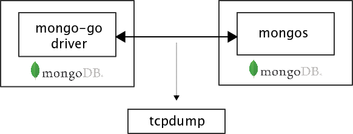

# 【エンジニア/東京】次世代分散データベースコース - プログラミング課題

## 集合課題

### 目的

- 課題であるMongoDB互換のデータベースの実装に必要な知識の習得
- グループワークの作業分担による共有し、参加者全員の理解レベルを共通化する

### 提出物

- MongoDB基本クエリーのプロトコルのまとめ
  - Insert、Update、Find、Update (参加者での分担を想定)

### MongoDBの通信プロトコルについて

MongoDBの通信プロトコルは「Wire Protocol」として、MongoDB Incより公式ドキュメントが公開されています。

- [MongoDB Wire Protocol](https://docs.mongodb.com/manual/reference/mongodb-wire-protocol/)

また、この通信プロトコルに流れるデータは、おなじくMongoDB Incが規定したBSON形式にてシリアライズされています。

- [BSON (Binary JSON) Serialization](http://bsonspec.org)

本課題では、上記のMongoDB Incによる公式な仕様を参照しつつ、取り組んでください。

### MongoDBの通信プロトコルの理解

本課題は、MongoDB Incによる上記の基本的仕様および、以下にあげるデータベースの基本操作の公式な仕様はあるものの、実装レベルまでの詳細な資料は整理されていません。

- [Database Commands — MongoDB Manual](https://docs.mongodb.com/manual/reference/command/)

このような背景から、今回はMongoDBの実際の通信シーケンスおよびパケットを`tcpdump`により確認します。

#### tcpdumpによる実際の通信シーケンスの確認

今回は、MongoDB Inc公式のクライアント(`mongo-go-driver`)を用いたテストプログラムと、公式のサーバー(`mongos`)との通信を確認します。



##### 準備


- MongoDBのインストール
- wiresharkのインストール

##### 確認

`tcpdump` .... MongoDBプロトコルを確認してみましょう。


```
tcpdump ...
```

## 個別課題

この課題は、MongoDBの通信プロトコルの理解し、MongoDB互換のサーバー実装を経験してもらいます。


### 課題 1

この課題は、MongoDB社より提供されている、公式のGo言語のクライアント実装を用いたユニットテストを通過するのを目的とします。

- [MongoDB Go Driver](https://github.com/mongodb/mongo-go-driver)

課題のユニットテストは、上記のGoクライアントドライバーのチュートリアルとして提供されている公式のチュートリアルに準じたもを準備しています。

- [MongoDB Go Driver Tutorial](https://www.mongodb.com/blog/post/mongodb-go-driver-tutorial)

#### 実装方法

課題は、現在一部の未実装な機能があるコードを実装し、ユニットテストの通過を目標とします。未実装な機能は、以下のファイルにある関数です。

- [step01_test.go (候補)](step01_test.go)

またプログラム内にコメントとしてヒントを残していますので

### 動作確認・提出方法


```
go test -run Client
```


## 課題 2

YCSB (Yahoo! Cloud Serving Benchmark))を用いて計測し ...... ボトルネックを .... 改良して下さい


- [Yahoo! Cloud Serving Benchmark (YCSB)](https://github.com/brianfrankcooper/YCSB/wiki)

YCSBは、....... 標準的なベンチマークプログラムで、MongoDBにも対応しています。

### 動作確認・提出方法

```
./mongos

ycsb ..... 
```


## 課題 3

この課題では、現在インメモリで動作しているMongoDB互換のサーバーを ...... LevelDBにて永続化する ....


