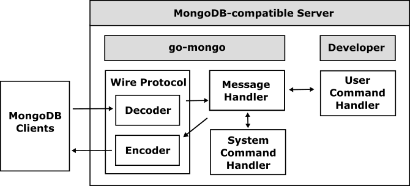

# go-mongo

The go-mongo is a database framework for implementing a [MongoDB](https://www.mongodb.com)-compatible server using Go easily.

## What is the go-mongo?

The go-mongo handles [MongoDB Wire Protocol](https://www.mongodb.com/docs/manual/reference/mongodb-wire-protocol/) and interprets the major messages automatically so that all developers can develop MongoDB-compatible servers easily. 

Since the go-mongo handles all system commands automatically, developers can easily implement their MongoDB-compatible server only by simply handling user query commands.

## Table of Contents

- [Getting Started](doc/getting-started.md)

## Examples

- [Examples](doc/examples.md)
	- [go-mongod](examples/go-mongod) 
	- [go-sqlserver](https://github.com/cybergarage/go-sqlserver) 
	- [PuzzleDB](https://github.com/cybergarage/puzzledb-go) 

## References

- [MongoDB](https://www.mongodb.com)
- [MongoDB Wire Protocol — MongoDB Manual](https://www.mongodb.com/docs/manual/reference/mongodb-wire-protocol/)
